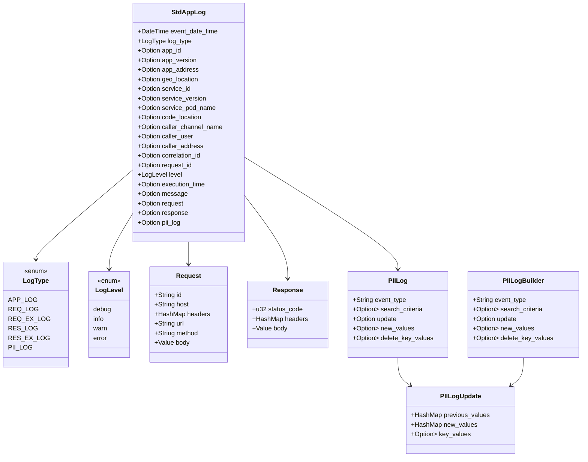

# Standard Application Log Version 1.0

This document describes the structure of a standard application log, which is designed to capture various types of events in an application. The log includes metadata about the application, request and response details, and any personally identifiable information (PII) that may be relevant.

## Structure


## Description
- **LogType**: Enum representing the type of log entry (e.g., application log, request log, etc.).
  - APP_LOG: General application log. 
  - REQ_LOG: Log for incoming requests. 
  - REQ_EX_LOG: Log for call to external services. 
  - RES_LOG: Log to respond incoming requests. 
  - RES_EX_LOG: Log for response from external services. 
  - PII_LOG: Log for personally identifiable information events.
- **LogLevel**: Enum representing the severity level of the log entry (e.g., debug, info, warn, error).
  - INFO: Informational messages that highlight the progress of the application at a coarse-grained level.
  - DEBUG: Fine-grained informational events that are most useful to debug an application.
  - WARN: Potentially harmful situations that still allow the application to continue running.
  - ERROR: Error events that might still allow the application to continue running.

## Example
### General App Log (LogType: APP_LOG)
```json
{
  "event_date_time": "2025-05-31T10:23:21.066Z",
  "log_type": "APP_LOG",
  "app_id": "AP1234",
  "app_version": "1.0.0",
  "app_address": "10.0.0.1:8080",
  "geo_location": "az-southeastasia",
  "service_id": "log-service",
  "service_version": "v1.2.3",
  "service_pod_name": "pod-app-log",
  "code_location": "app::startup",
  "caller_channel_name": "CAPI",
  "correlation_id": "2cc6142a-10e8-4eee-a2bf-65411d9aa59e",
  "level": "info",
  "execution_time": 5,
  "message": "Application started successfully."
}
```
### Request Log (LogType: REQ_LOG)
```json
{
  "event_date_time": "2025-05-31T10:23:21.066Z",
  "log_type": "REQ_LOG",
  "app_id": "AP1234",
  "app_version": "1.0.1",
  "app_address": "10.0.0.2:8080",
  "geo_location": "az-eastasia",
  "service_id": "api-gateway",
  "service_version": "v2.0.0",
  "service_pod_name": "pod-req-log",
  "code_location": "gateway::handler",
  "caller_channel_name": "CAPI",
  "correlation_id": "2cc6142a-10e8-4eee-a2bf-65411d9aa59e",
  "request_id": "3d19fd66-2251-44fa-a667-a361bd23d6d3",
  "level": "info",
  "execution_time": 12,
  "message": "Received API request",
  "request": {
    "id": "3d19fd66-2251-44fa-a667-a361bd23d6d3",
    "host": "",
    "headers": {
      "X-Trace-Id": "abc123"
    },
    "url": "/api/hello",
    "method": "POST",
    "body": {
      "data": "example"
    }
  }
}
```
### Response Log (LogType: RES_LOG)
```json
{
  "event_date_time": "2025-05-31T10:23:21.066Z",
  "log_type": "RES_LOG",
  "app_id": "AP1234",
  "app_version": "1.0.3",
  "app_address": "10.0.0.4:8080",
  "geo_location": "az-japaneast",
  "service_id": "payment-service",
  "service_version": "v3.0.0",
  "service_pod_name": "pod-res-log",
  "code_location": "payment::send_response",
  "caller_channel_name": "CAPI",
  "correlation_id": "2cc6142a-10e8-4eee-a2bf-65411d9aa59e",
  "request_id": "3d19fd66-2251-44fa-a667-a361bd23d6d3",
  "level": "info",
  "execution_time": 20,
  "message": "Sent response to client",
  "response": {
    "status_code": 200,
    "headers": {
      "Content-Type": "application/json"
    },
    "body": {
      "first_name": "xxx",
      "last_name": "yyy"
    }
  }
}
```
### Request to External Service Log (LogType: REQ_EX_LOG)
```json
{
  "event_date_time": "2025-05-31T10:23:21.066Z",
  "log_type": "REQ_EX_LOG",
  "app_id": "AP1234",
  "app_version": "1.0.2",
  "app_address": "10.0.0.3:8080",
  "geo_location": "az-westindia",
  "service_id": "auth-service",
  "service_version": "v1.5.0",
  "service_pod_name": "pod-reqex-log",
  "code_location": "auth::validate_user",
  "caller_channel_name": "CAPI",
  "correlation_id": "bc3770b6-5512-4d8f-be9b-c1d1b33cffee",
  "request_id": "14bd2b6e-420e-47af-a06c-082a9efe5d7c",
  "level": "debug",
  "execution_time": 30,
  "message": "Calling hello API",
  "request": {
    "id": "14bd2b6e-420e-47af-a06c-082a9efe5d7c",
    "host": "example.com",
    "headers": {
      "X-Trace-Id": "abc123"
    },
    "url": "/api/hello",
    "method": "POST",
    "body": {
      "data": "example"
    }
  }
}
```
### Response from External Service Log (LogType: RES_EX_LOG)
```json
{
  "event_date_time": "2025-05-31T10:23:21.067Z",
  "log_type": "RES_EX_LOG",
  "app_id": "AP1234",
  "app_version": "1.0.3",
  "app_address": "10.0.0.4:8080",
  "geo_location": "az-japaneast",
  "service_id": "payment-service",
  "service_version": "v3.0.0",
  "service_pod_name": "pod-res-log",
  "code_location": "payment::send_response",
  "caller_channel_name": "CAPI",
  "correlation_id": "bc3770b6-5512-4d8f-be9b-c1d1b33cffee",
  "request_id": "14bd2b6e-420e-47af-a06c-082a9efe5d7c",
  "level": "info",
  "execution_time": 20,
  "message": "Sent response to client",
  "response": {
    "status_code": 200,
    "headers": {
      "Content-Type": "application/json"
    },
    "body": {
      "first_name": "xxx",
      "last_name": "yyy"
    }
  }
}
```
### PII Log (LogType: PII_LOG)
PII Log is used to log event-related manipulation of personally identifiable information (PII). It can include search criteria, updates, new values, and deletions of PII data.

- Search Criteria: Criteria used to search for PII data.
```json
{
  "event_date_time": "2025-05-31T10:31:31.248Z",
  "log_type": "PII_LOG",
  "app_id": "AP1234",
  "caller_user": "t12345",
  "caller_address": "12.0.1.1",
  "level": "info",
  "pii_log": {
    "event_type": "Search Screen A",
    "search_criteria": {
      "ID": "12345",
      "Email": "abc@gmail.com",
      "Name": "John Doe"
    }
  }
}
```
- Add New Values: Log for adding new PII data.
```json
{
  "event_date_time": "2025-05-31T10:31:31.248Z",
  "log_type": "PII_LOG",
  "app_id": "AP1234",
  "caller_user": "t12345",
  "caller_address": "12.0.1.1",
  "level": "info",
  "pii_log": {
    "event_type": "Add New Customer",
    "new_values": {
      "Name": "John Doe",
      "ID": "12345",
      "Phone": "123-456-7890",
      "Email": "abc@gmail.com",
      "Credit Card": "1234-5678-9012-3456",
      "Address": "123 Main St, City, Country"
    }
  }
}
```
- Update Existing Values: Log for updating existing PII data.
```json
{
  "event_date_time": "2025-05-31T10:31:31.248Z",
  "log_type": "PII_LOG",
  "app_id": "AP1234",
  "caller_user": "t12345",
  "caller_address": "12.0.1.1",
  "level": "info",
  "pii_log": {
    "event_type": "Update Customer Info",
    "update": {
      "previous_values": {
        "Name": "John Doe",
        "Email": "abc@gmail.com"
      },
      "new_values": {
        "Email": "abc123@gmail.com",
        "Name": "John Doe X"
      },
      "key_values": {
        "ID": "12345"
      }
    }
  }
}
```
- Delete Key Values: Log for deleting specific PII data.
```json
{
  "event_date_time": "2025-05-31T10:31:31.248Z",
  "log_type": "PII_LOG",
  "app_id": "AP1234",
  "caller_user": "t12345",
  "caller_address": "12.0.1.1",
  "level": "info",
  "pii_log": {
    "event_type": "Delete Customer Info",
    "delete_key_values": {
      "ID": "12345"
    }
  }
}
```
